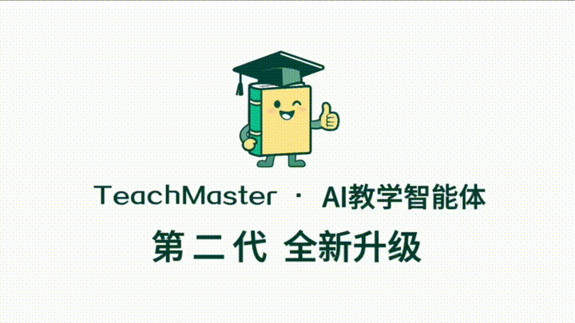
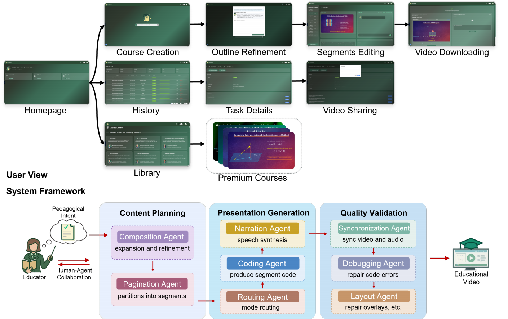
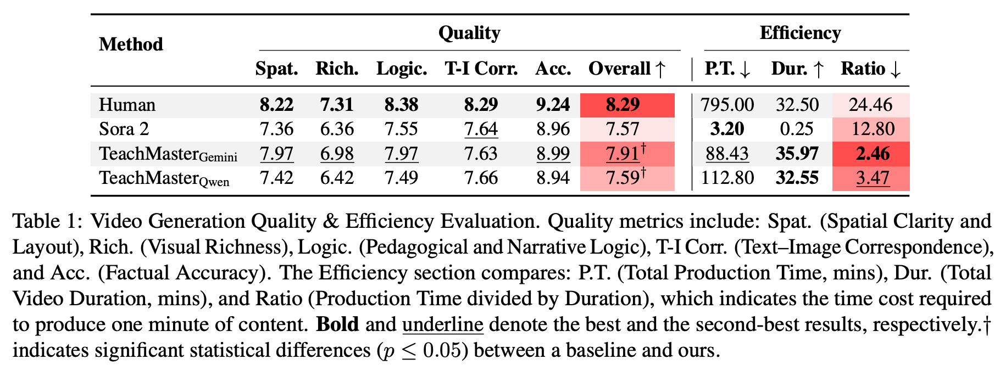

<p align="center">
  
</p>

<h1 align="center">TeachMaster: Generative Teaching via Code</h1>


<p align="center">
  <a href="https://aclanthology.org/2026.acl-industry.7/"></a>
  <a href="https://www.teachmaster.cn"></a>
  <a href="https://mp.weixin.qq.com/s/lCaqkI165X-T2mmto2iQ9A"></a>
</p>

TeachMaster introduces **Generative Teaching**, a new paradigm where educators act as high-level directors while AI agents handle lesson planning, visual design, animation rendering, narration, and quality validation.

Unlike end-to-end pixel-level video generation, TeachMaster uses **executable code as an intermediate semantic medium**. This makes generated teaching videos more interpretable, editable, controllable, and suitable for scalable educational content production.

<p align="center">
  <a href="figs/teachmaster.mp4">
    
  </a>
  <br/>
  <a href="figs/teachmaster.mp4">👉 Watch the full video</a>
</p>

## 📰 News

- 🚀 **June 2026**: TeachMaster 3.0 was released.
- ✨ **April 2026**: TeachMaster 2.0 was released.
- 🏆 **April 2026**: The TeachMaster paper was accepted by ACL 2026.
- 🎉 **December 2025**: TeachMaster 1.0 was launched.

## ✨ Highlights

- **Intent-driven course creation**: transforms lecture outlines and pedagogical goals into complete multimodal teaching videos.
- **Code-centric generation**: uses executable visual code to preserve structure, timing, layout, and editability.
- **Multi-agent workflow**: coordinates content planning, visual synthesis, narration, TTS, debugging, synchronization, and layout optimization.
- **Human-in-the-loop refinement**: supports both natural-language editing and direct code-level intervention.
- **Cross-modal alignment**: keeps narration, visuals, and instructional logic semantically consistent.
- **Broad applicability**: supports bilingual and cross-disciplinary course generation across STEM, humanities, and professional education.

## 🧩 Framework

TeachMaster decomposes educational video production into three main stages:

<p align="center">
  
</p>

1. **Content Planning**  
   Converts raw teaching intents into coherent manuscripts and page-level instructional blueprints.

2. **Presentation Generation**  
   Transforms each blueprint into code-driven visual animations, narration scripts, and synthesized speech.

3. **Quality Validation**  
   Improves rendering reliability, audio-visual synchronization, and layout clarity through iterative debugging and refinement.

## 📊 Results

Experiments show that TeachMaster approaches the quality of human-crafted educational videos while offering a substantial efficiency advantage over traditional production workflows and end-to-end video generation baselines.

<p align="center">
  
</p>


TeachMaster demonstrates strong performance in:

- video generation quality,
- educational script quality,
- cross-modal semantic alignment,
- production efficiency,
- real-world educator and student feedback.

<p align="center">
  
</p>

In practical deployment, TeachMaster has served **1,500+ educators**, generated **140,000+ minutes** of educational content, and covered **420+ disciplines**. Producing a standard 45-hour semester-long course costs approximately **0.3%** of traditional online course production expenses.


## 📌 Citation

```
@inproceedings{wang-etal-2026-teachmaster,
  title = "TeachMaster: Generative Teaching via Code",
  author = "Wang, Yuheng and Yang, Runde and Wu, Lin and Zhang, Jie and Fan, Jingru and Zhou, Tianle and Fu, Ruoyu and Li, Huatao and Shi, Ruijie and Chen, Siheng and E, Weinan and Qian, Chen",
  month = July,
  year = "2026",
  publisher = "Association for Computational Linguistics",
  url = "https://aclanthology.org/2026.acl-industry.7/",
  doi = "10.18653/v1/2026.acl-industry.7"
}
```

## 📬 Contact

If you have any questions, feedback, or would like to get in touch, please feel free to reach out to us via email at [qianc62@gmail.com](mailto:qianc62@gmail.com) or [yuhengwangagent@gmail.com](mailto:yuhengwangagent@gmail.com).
